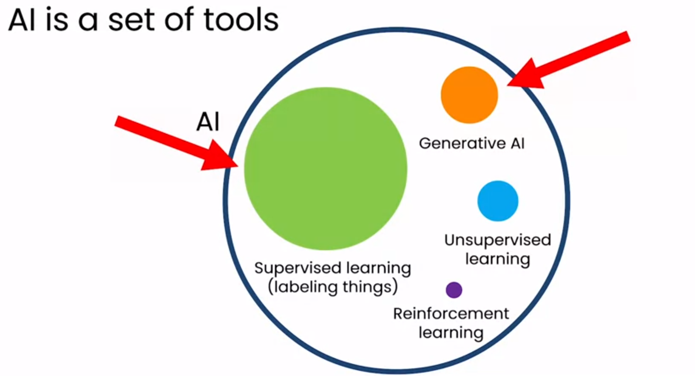
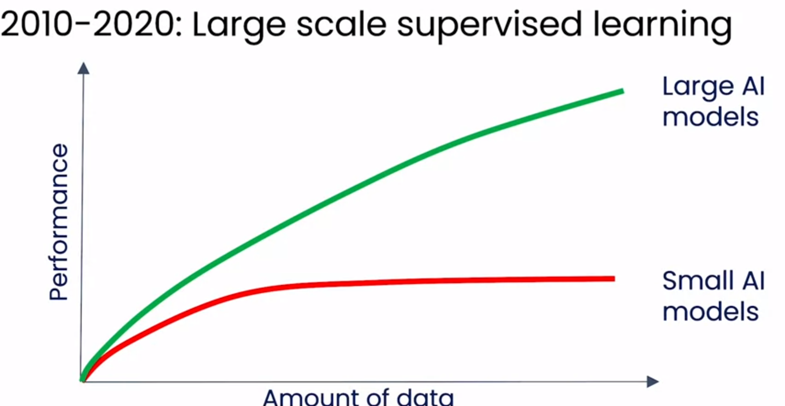
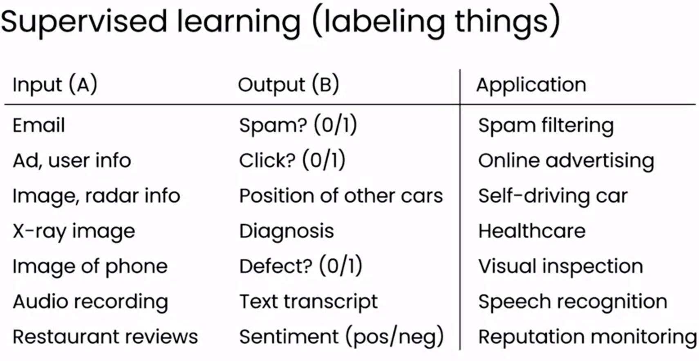

# Generative_Ai
 What is generative AI?  This term refers to AI, or artificial intelligence systems that can produce high-quality content, specifically text, images, and audio.   

 

 its performance wasn't getting that much better if we were training small AI models.

**LLMs**

large language model are built by using supervised learning to repeatedly predict the next word.
 
LLMs not just predict the next word, but actually learn to follow instructions and also be safe in what it outputs. 
But at the heart of LLMs is this technology that's learned from a lot of data to predict what is the next word. That's how large language models work;
**they're trained to repeatedly predict the next word.**

 
LLMs are giving a new way to find information
 
LLM can sometimes make facts up. We call this hallucination.
 

AI is a general-purpose technology. 
 
ex of tasks LLMs can carry out:
1. writting
2. reading => looking at a relatively long piece of text
3. chatting

 
two differnt types of LLM-based application: 

    -web interface-based application
    -software-based application

